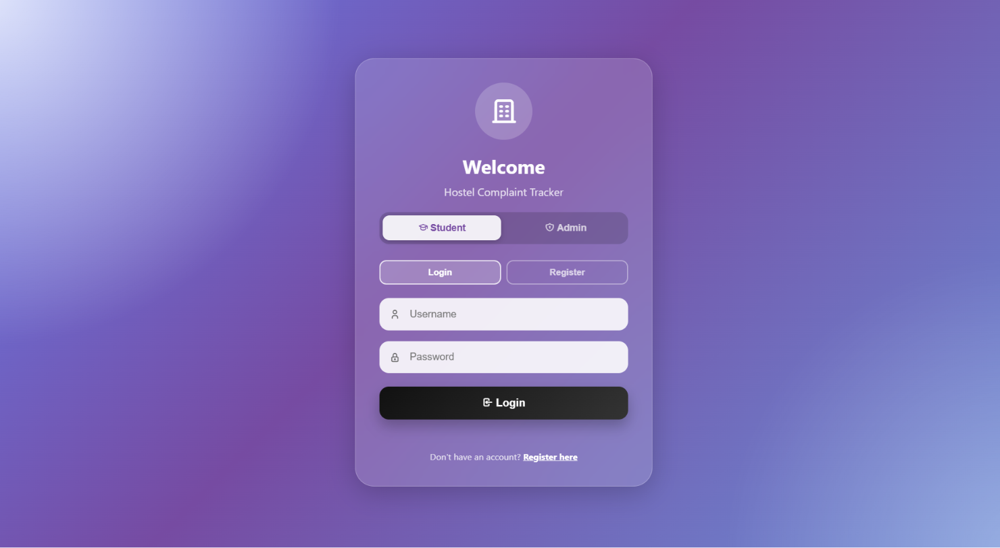
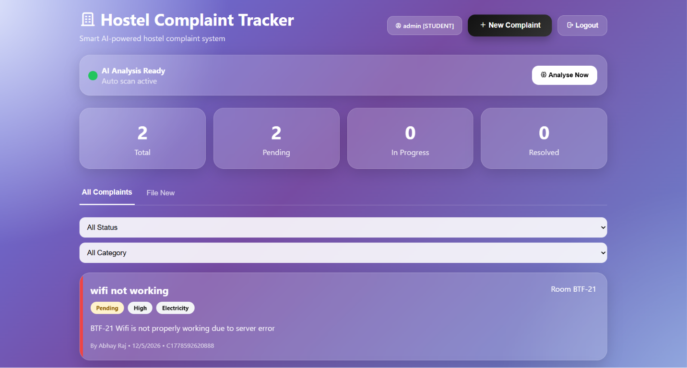
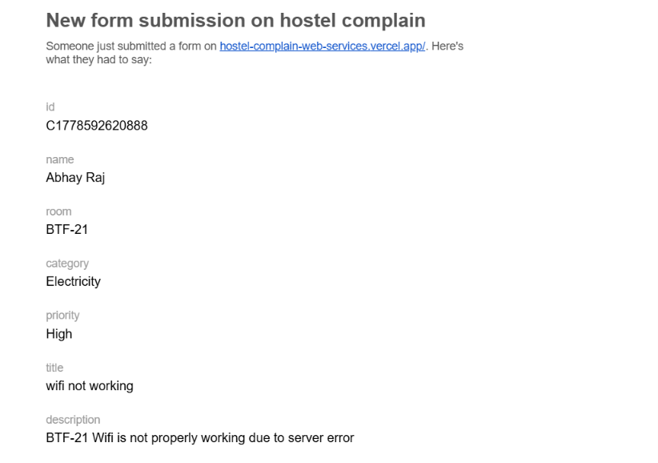

<div align="center">


<br/>

[](https://hostel-complain-web-services.vercel.app/)
[](https://github.com/)

<br/>

[](https://developer.mozilla.org/en-US/docs/Web/HTML)
[](https://developer.mozilla.org/en-US/docs/Web/CSS)
[](https://developer.mozilla.org/en-US/docs/Web/JavaScript)
[](https://www.anthropic.com/)
[](https://vercel.com/)
[](LICENSE)

<br/>

> 🏠 **HostelTrack** is a sleek, glassmorphism-styled hostel complaint management system with dual-role access (Student & Admin).
> Powered by **AI analysis**, it auto-scans complaints, prioritizes issues, and notifies via email —
> all with a beautiful **purple-gradient UI** and real-time status tracking.

<br/>

</div>

---

## 📸 Screenshots

<div align="center">

| 🔐 Login / Register | 📊 Student Dashboard |
|:---:|:---:|
|  |  |

| 📧 Email Notification |
|:---:|
|  |

</div>

---

## 🎯 The Problem This Solves

<div align="center">

> ### *"Hostel complaints register mein likhna — aur phir bhool jaana — ek common problem hai."*
> *("Writing hostel complaints in a register — and then forgetting — is a very common problem.")*

</div>

Hostel complaint management in India is still largely manual:

<div align="center">

| Problem | Impact |
|:-------:|:------:|
| 📋 Paper complaint registers | Complaints lost, no tracking |
| 📞 No real-time status updates | Students left in the dark |
| 🔍 No priority-based visibility | Critical issues delayed |
| ✍️ Manual admin review | Hours wasted daily |

</div>

### 😔 The Student Struggle

```
🧑‍🎓 Student:  "Maine complaint ki thi WiFi ki — kya hua?"
🗂️ Warden:    *digs through register, WhatsApp chats*
⏰ Result:     Issue unresolved. Complaint forgotten. Frustration rises.
```

**HostelTrack solves this in one click.**

---

## 💡 The Solution — One Dashboard, Everything

<div align="center">

```
╔══════════════════════════════════════════════════════════════════╗
║                                                                  ║
║   🧑‍🎓  Student files complaint with category & priority          ║
║              │                                                   ║
║              ▼                                                   ║
║   📧  Admin notified via email instantly                         ║
║              │                                                   ║
║              ▼                                                   ║
║   🤖  AI scans & analyses all complaints automatically           ║
║              │                                                   ║
║              ▼                                                   ║
║   🔴  High-priority complaints flagged for quick action          ║
║              │                                                   ║
║              ▼                                                   ║
║   ✅  Admin updates status → Student sees it in real-time!       ║
║                                                                  ║
╚══════════════════════════════════════════════════════════════════╝
```

</div>

No registers. No manual chasing. No missed complaints. **Just results.**

---

## ✨ Features

<div align="center">

| Feature | Description |
|:-------:|:------------|
| 🔐 **Dual Role Login** | Separate Student & Admin login with Register support |
| 📊 **Live Dashboard** | Total, Pending, In Progress & Resolved — updated in real-time |
| 📝 **File Complaints** | Submit with title, description, room, category & priority level |
| 🏷️ **Smart Categories** | Electricity, Water, WiFi, Cleanliness, Furniture, Security & more |
| 🔍 **Filter & Search** | Filter by status (All / Pending / In Progress / Resolved) & category |
| 🤖 **AI Analysis** | Auto-scan active — analyses all complaints with one click |
| 📧 **Email Notifications** | Auto-email sent to admin on every new complaint submission |
| 🆔 **Unique Complaint IDs** | Every complaint gets a traceable ID (e.g. `C1778592620888`) |
| 📱 **Responsive Design** | Works on desktop, tablet & mobile |
| 🎨 **Glassmorphism UI** | Stunning purple gradient dark theme with glass-effect cards |

</div>

---

## 🤖 AI Analysis — How It Works

```
Step 1 → Student submits a complaint (e.g. "WiFi not working – High priority")
Step 2 → Email notification fires to admin automatically
Step 3 → AI auto-scan runs in the background (or click "Analyse Now")
Step 4 → AI categorizes, flags priority, and surfaces critical complaints
Step 5 → Admin takes action → updates status → student sees it live!
```

> 🔑 AI analysis runs securely — no personal data is shared with external services.

---

## 🚀 Getting Started

<div align="center">

### ▶️ Option 1 — Open Online (Recommended)

[](https://hostel-complain-web-services.vercel.app/)

*No download. No account setup. Click and go.*

</div>

### 💻 Option 2 — Run Locally

```bash
# Clone the repository
git clone https://github.com/your-username/hostel-complaint-tracker.git

# Navigate into the project
cd hostel-complaint-tracker

# Open in browser — NO build step needed!
open index.html        # macOS
start index.html       # Windows
xdg-open index.html    # Linux
```

> ✅ **100% static. Zero dependencies. Zero build tools.** Just open the file.

---

## 🧪 Demo Credentials

| Role | Username | Password |
|:----:|:--------:|:--------:|
| 🧑‍🎓 Student | `admin` | `(your password)` |
| 🛡️ Admin | `admin` | `(admin password)` |

> FeeTrack ships with pre-loaded sample complaints so you can **explore every feature immediately**.

---

## 🛠️ Tech Stack

```
🌐 Frontend      →   Pure HTML5 + CSS3 + Vanilla JavaScript
🤖 AI Engine     →   Claude AI (Anthropic) via REST API
🎨 Design        →   Glassmorphism, CSS animations, purple gradient theme
📧 Notifications →   Email integration via Web Services (Vercel)
🚀 Deployment    →   Vercel (zero-config, auto-deploy from GitHub)
```

**Zero heavy frameworks. Single-file core. Instant deployment.**

---

## 📁 Project Structure

```
hostel-complaint-tracker/
│
├── 📄 index.html          ← Login & auth screen
├── 📄 dashboard.html      ← Main complaint dashboard
├── 📄 admin.html          ← Admin panel & controls
├── 📄 style.css           ← Glassmorphism design system
├── 📄 app.js              ← Core logic & AI integration
│
└── 📄 README.md           ← You are here!
```

---

## 🎨 Design System

<div align="center">

| Token | Hex | Usage |
|:-----:|:---:|:-----:|
| `--purple-dark` | `#7B5EA7` | Primary actions, header |
| `--purple-mid` | `#9B6DF5` | Gradients, highlights |
| `--purple-light` | `#C850C0` | Accents, hover states |
| `--glass-bg` | `rgba(255,255,255,0.1)` | Card surfaces (glassmorphism) |
| `--yellow` | `#F5C518` | Pending status badge |
| `--red` | `#FF4565` | High priority / overdue |
| `--green` | `#0FD98B` | Resolved / success states |
| `--bg-grad` | `#6B48A8 → #9B6DF5` | Page background gradient |

</div>

---

## 📱 Device Compatibility

<div align="center">

| Device | Browser | Support |
|:------:|:-------:|:-------:|
| 💻 Desktop | Chrome / Edge / Firefox / Safari | ✅ Full support |
| 📱 Android | Chrome | ✅ Works great |
| 🍎 iPhone / iPad | Safari | ✅ Full support |
| 🖥️ Hostel / Office PC | Any modern browser | ✅ Ideal for daily use |

</div>

---

## 🔮 Roadmap

- [ ] 📤 Export complaint history to PDF / CSV
- [ ] 🔔 Browser push notifications for status updates
- [ ] 📊 Monthly complaint trend charts for admin
- [ ] 💬 In-app chat between student & warden
- [ ] 🔐 LocalStorage / cloud persistence across sessions
- [ ] 📲 PWA — installable as offline app
- [ ] 🌍 Hindi / regional language UI support
- [ ] 🏛️ Multi-hostel / multi-floor support

---

## 🤝 Contributing

Contributions, issues and feature requests are welcome!

```bash
# Fork the repo, then:
git checkout -b feature/your-feature-name
git commit -m "feat: describe your change"
git push origin feature/your-feature-name
# Open a Pull Request
```

---

## 📄 License

```
MIT License — free to use, modify, and distribute.
© 2026 HostelTrack · Built for hostel administrators & students
```

---

<div align="center">


**Built with ❤️ for hostel students & wardens · Powered by Claude AI**

⭐ **Star this repo if HostelTrack helped you today!**

[](https://hostel-complain-web-services.vercel.app/)

</div>
